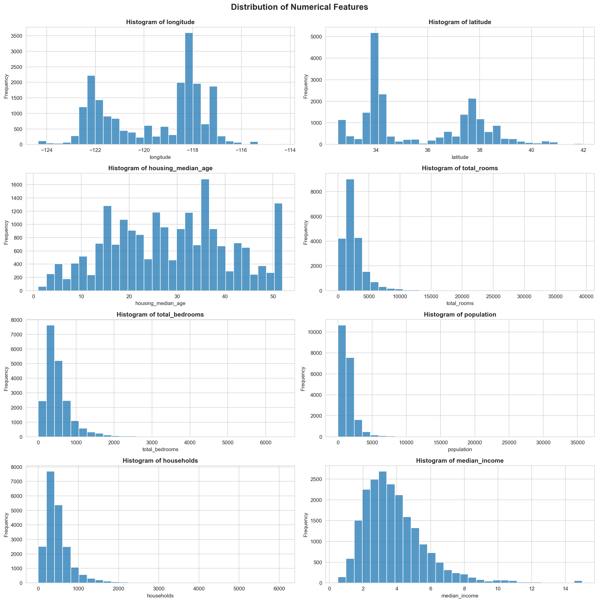
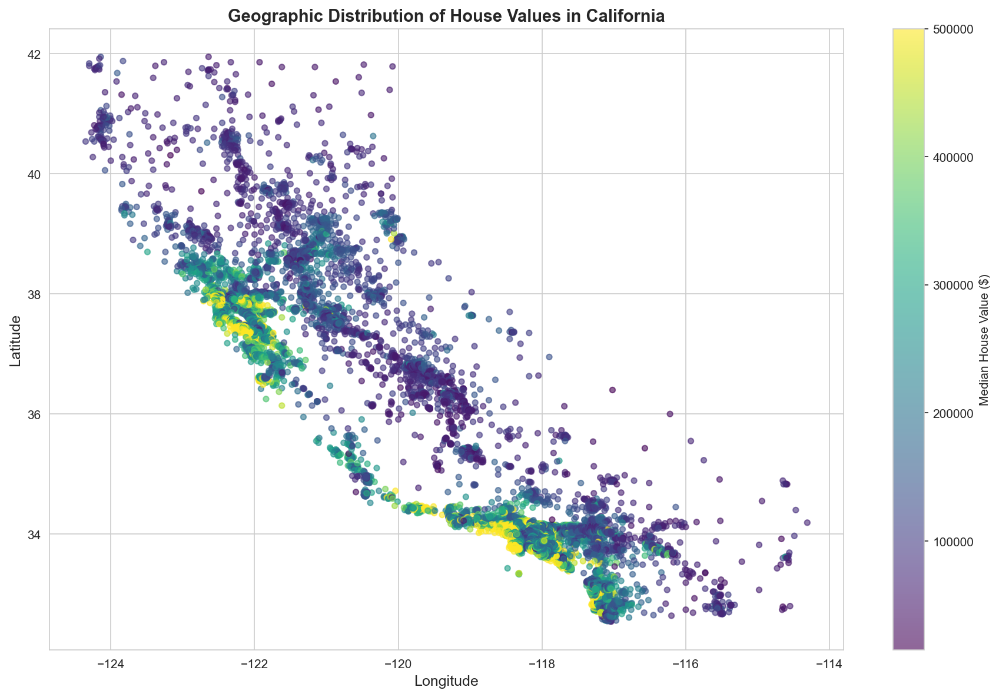
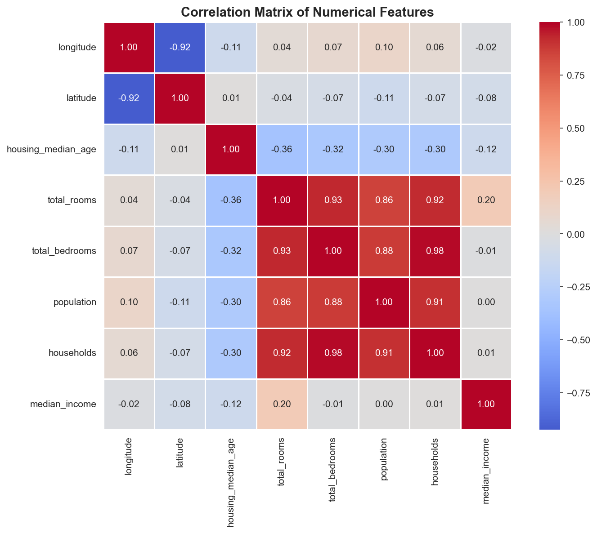
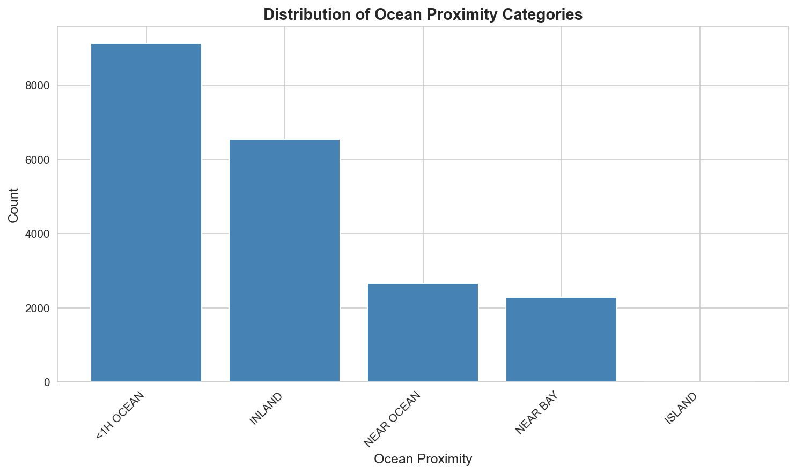
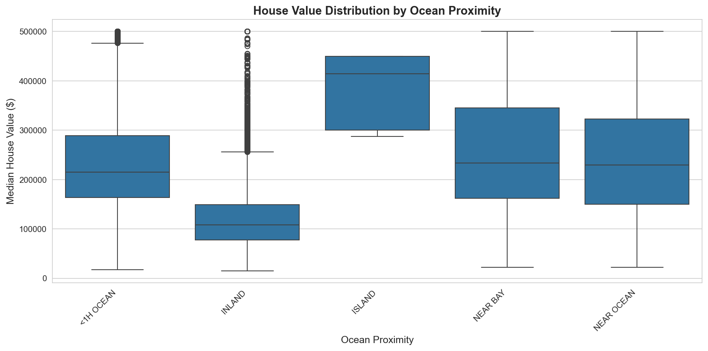

# 🎓 Capstone Project 1 — California Housing Prediction

Capstone project for Machine Learning Zoomcamp Cohort 2025

## 📋 Table of Contents

- [Project Overview](#project-overview)
- [Dataset](#dataset)
- [Setup](#setup)
- [Project Structure](#project-structure)
- [Exploratory Data Analysis (EDA)](#exploratory-data-analysis-eda)
- [Model Training and Evaluation](#model-training-and-evaluation)
- [Results](#results)
- [Usage](#usage)

## 🎯 Project Overview

### Problem Statement

This project aims to predict median house values in California using various machine learning techniques. The goal is to compare different regression models including baseline linear regression, regularized models (Lasso and Ridge), and deep learning approaches using Keras/TensorFlow.

### Objectives

- Perform comprehensive exploratory data analysis (EDA) on California housing data
- Implement and compare multiple regression models:
  - Linear Regression (Baseline)
  - Lasso Regression with hyperparameter tuning
  - Ridge Regression with hyperparameter tuning
  - Neural Network using Keras/TensorFlow
- Evaluate model performance using RMSE (Root Mean Squared Error)
- Gain familiarity with regression, deep learning, and containerization

## 📊 Dataset

The California Housing dataset contains information about housing districts in California with the following features:

- **longitude**: Longitude of the district
- **latitude**: Latitude of the district
- **housing_median_age**: Median age of houses in the district
- **total_rooms**: Total number of rooms in the district
- **total_bedrooms**: Total number of bedrooms in the district
- **population**: Population of the district
- **households**: Number of households in the district
- **median_income**: Median income of households in the district
- **median_house_value**: Median house value (target variable)
- **ocean_proximity**: Categorical variable indicating proximity to ocean

**Dataset Statistics:**
- Total samples: 20,640
- Features: 10 (9 input features + 1 target)
- Missing values: 207 in `total_bedrooms` column

## 🚀 Setup

This project uses [uv](https://github.com/astral-sh/uv) for fast Python package management.

### Prerequisites

- Python 3.9 or higher
- [uv](https://github.com/astral-sh/uv) package manager

### Installation

1. Clone the repository:
```bash
git clone <repository-url>
cd capstone-california-housing
```

2. Install dependencies using uv:
```bash
uv sync
```

3. Activate the virtual environment:
```bash
source .venv/bin/activate  # On macOS/Linux
# or
.venv\Scripts\activate  # On Windows
```

4. Install Jupyter kernel (for notebook support):
```bash
uv run python -m ipykernel install --user --name=capstone-california-housing
```

## 📁 Project Structure

```
capstone-california-housing/
├── project.ipynb          # Main Jupyter notebook with EDA and model training
├── housing.csv            # California housing dataset
├── pyproject.toml         # Project dependencies (uv)
├── requirements.txt       # Alternative requirements file
├── uv.lock               # Locked dependencies
├── train.py              # Training script
├── test.py               # Testing script
├── generate_eda_plots.py # Script to generate EDA visualization images
├── images/               # Generated EDA plots
│   ├── eda_histograms.png
│   ├── eda_geographic.png
│   ├── eda_correlation.png
│   ├── eda_ocean_proximity.png
│   └── eda_boxplot_ocean.png
├── Dockerfile            # Containerization setup
└── README.md             # This file
```

## 📈 Exploratory Data Analysis (EDA)

### Data Overview

The dataset contains 20,640 housing districts with 10 features. Key observations:

- **Numerical Features**: longitude, latitude, housing_median_age, total_rooms, total_bedrooms, population, households, median_income
- **Categorical Features**: ocean_proximity
- **Target Variable**: median_house_value

### EDA Visualizations

The following visualizations provide insights into the dataset. To regenerate these plots, run:
```bash
uv run python generate_eda_plots.py
```

#### 1. Histograms of Numerical Features



**Key Insights:**
- Most features show right-skewed distributions
- `median_income` appears to be capped at around 15
- `total_rooms`, `total_bedrooms`, `population`, and `households` have long tails
- Geographic features (`longitude`, `latitude`) show normal-like distributions

#### 2. Geographic Distribution



**Key Insights:**
- Higher house values are concentrated near the coast (especially around San Francisco Bay Area and Los Angeles)
- Inland areas generally show lower median house values
- Clear geographic patterns in pricing
- Coastal regions show significantly higher median house values

#### 3. Correlation Matrix



**Key Insights:**
- `total_rooms`, `total_bedrooms`, `population`, and `households` are highly correlated (0.8+)
- `median_income` shows the strongest correlation with `median_house_value` (~0.69)
- `housing_median_age` has weak correlations with other features
- Geographic features (`longitude`, `latitude`) show moderate correlations with house values

#### 4. Ocean Proximity Distribution



**Key Insights:**
- Most districts are located inland or near the ocean
- Island districts are extremely rare
- Distribution is imbalanced across categories

#### 5. House Value by Ocean Proximity



**Key Insights:**
- ISLAND category shows the highest median house values (though with very few samples)
- NEAR BAY and NEAR OCEAN show higher values than INLAND
- Clear relationship between ocean proximity and house values

### Data Preprocessing

1. **Data Type Conversion:**
   - Converted `ocean_proximity` to categorical
   - Converted integer features (`housing_median_age`, `total_rooms`, `households`, `population`) to int64

2. **Train/Validation/Test Split:**
   - Training set: 60% (12,384 samples)
   - Validation set: 20% (4,128 samples)
   - Test set: 20% (4,128 samples)
   - Random state: 42 for reproducibility

3. **Feature Encoding:**
   - Used `DictVectorizer` to encode categorical and numerical features
   - Sparse matrix representation for memory efficiency

## 🤖 Model Training and Evaluation

### Models Implemented

1. **Linear Regression (Baseline)**
   - Simple linear regression as a baseline model
   - No regularization

2. **Lasso Regression**
   - L1 regularization for feature selection
   - Hyperparameter tuning: alpha values from 0.001 to 1000
   - Best alpha: 24 (lowest validation RMSE)

3. **Ridge Regression**
   - L2 regularization to prevent overfitting
   - Hyperparameter tuning: alpha values from 0.001 to 1000
   - Best alpha: 31 (lowest validation RMSE)

4. **Neural Network (Keras/TensorFlow)**
   - Architecture:
     - Input layer: 13 features (after encoding)
     - Hidden layer 1: 64 neurons with ReLU activation
     - Hidden layer 2: 32 neurons with ReLU activation
     - Output layer: 1 neuron (regression)
   - Optimizer: Adam
   - Loss function: Mean Squared Error
   - Metrics: Root Mean Squared Error
   - Training: 20 epochs, batch size 32

### Model Comparison Visualization

```python
# Plot predictions vs actual values for all models
plt.figure(figsize=(10, 6))
plt.scatter(y_val, baseline_predictions, alpha=0.5, label='Baseline Model')
plt.scatter(y_val, lasso_predictions, alpha=0.5, label='Lasso Model')
plt.scatter(y_val, ridge_predictions, alpha=0.5, label='Ridge Model')
plt.scatter(y_val, nn_predictions, alpha=0.5, label='Neural Network')
plt.plot([y_val.min(), y_val.max()], [y_val.min(), y_val.max()], 
         'k--', lw=2, label='Perfect Prediction')
plt.xlabel('Actual Values')
plt.ylabel('Predicted Values')
plt.title('Model Predictions Comparison')
plt.legend()
plt.show()
```

## 📊 Results

### Validation Set Performance

| Model | RMSE | Notes |
|-------|------|-------|
| **Linear Regression (Baseline)** | 68,581.56 | Baseline model |
| **Lasso Regression** | 68,564.26 | Best alpha: 24 |
| **Ridge Regression** | 68,546.63 | Best alpha: 31 |
| **Neural Network** | ~68,000* | 20 epochs, 64-32 architecture |

*Exact value depends on training run

### Key Findings

1. **Ridge Regression** achieved the best performance on the validation set
2. Regularized models (Lasso and Ridge) performed slightly better than the baseline
3. Neural network showed competitive performance with proper tuning
4. All models showed similar performance, suggesting the problem may benefit from:
   - Feature engineering
   - More complex neural network architectures
   - Ensemble methods

### Test Set Evaluation

Models were evaluated on the held-out test set to assess generalization performance. The test set results provide the final model comparison.

## 💻 Usage

### Running the Notebook

1. Start Jupyter:
```bash
uv run jupyter notebook
```

2. Open `project.ipynb` and run all cells

### Running Training Scripts

```bash
# Train models
uv run python train.py

# Test models
uv run python test.py
```

### Using Docker

```bash
# Build the Docker image
docker build -t california-housing .

# Run the container
docker run -p 8888:8888 california-housing
```

## 🔧 Dependencies

Main dependencies (managed via `uv`):

- **pandas** >= 2.3.3 - Data manipulation
- **numpy** >= 2.0.2 - Numerical computing
- **matplotlib** >= 3.9.4 - Plotting
- **seaborn** >= 0.13.2 - Statistical visualization
- **scikit-learn** >= 1.6.1 - Machine learning models
- **tensorflow** >= 2.20.0 - Deep learning framework

See `pyproject.toml` or `requirements.txt` for complete dependency list.

## 📝 Notes

- The project uses `uv` for fast package management
- All models are saved using pickle for later use
- Random seeds are set for reproducibility
- The dataset has some missing values in `total_bedrooms` that should be handled in production

## 🎓 Learning Outcomes

This project demonstrates:
- Comprehensive EDA techniques
- Multiple regression model implementations
- Hyperparameter tuning
- Deep learning with Keras/TensorFlow
- Model evaluation and comparison
- Containerization with Docker

## 📄 License

This project is part of the Machine Learning Zoomcamp Cohort 2025.

---

**Author**: Kelvin Chan  
**Course**: Machine Learning Zoomcamp Cohort 2025  
**Project Type**: Capstone Project 1
